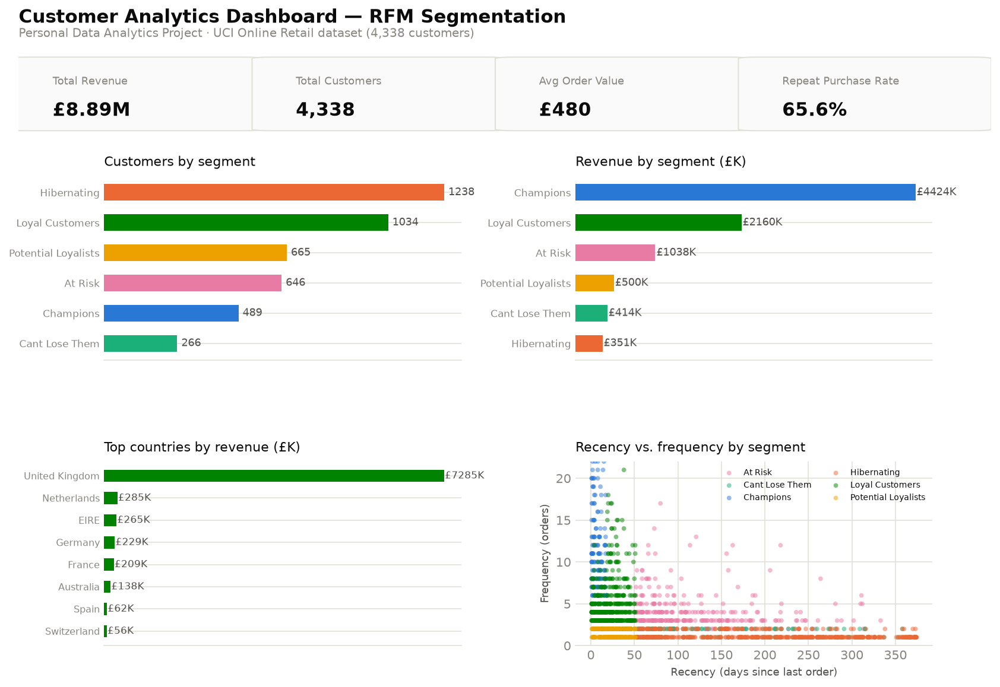

# Customer Analytics Dashboard

**Personal Data Analytics Project** — built independently using a public
dataset for portfolio purposes. This is not client work or employer work.

Power BI + SQL + Python RFM (Recency, Frequency, Monetary) segmentation to
identify which customers actually drive revenue — and which are quietly
slipping away.



## Dataset

The [UCI Online Retail dataset](https://archive.ics.uci.edu/dataset/352/online+retail)
— ~541,909 real transactions (Dec 2010–Dec 2011) from a UK-based online gift
retailer, covering 4,338 customers across 37 countries.

## Business problem

Framed as a realistic retention/marketing analytics brief: the business
treats all customers roughly the same in retention campaigns, with no
shared, data-backed view of which customers are high-value, which are at
risk of churning, and where to focus limited retention budget.

## Approach

1. **Python** (`python/clean_and_analyze.py`) — removes cancelled orders
   (invoice numbers prefixed `C`), rows with missing customer IDs, and
   non-positive quantity/price; computes Recency/Frequency/Monetary per
   customer, quartile-scores each dimension, and rule-maps scores to six
   named segments (Champions, Loyal Customers, At Risk, etc.).
2. **SQL** (`sql/queries.sql`) — the same and additional questions in SQL
   against the cleaned transaction + RFM tables, including `RANK()`,
   `NTILE()` for decile analysis, and `LAG()` for month-over-month revenue
   change. Real output in `sql/sample_results.md`.
3. **Power BI** (`powerbi/data-model.md`) — data model and DAX measures
   documented and ready to build in Power BI Desktop.

> **Note on data size:** the raw (23MB) and full cleaned transaction-level
> (36MB) files are not committed to keep the repo lean — `python/download_data.py`
> fetches the raw file, and `clean_and_analyze.py` regenerates everything
> else. The compact per-customer RFM table (`rfm_segments.csv`, ~180KB) and
> all summary aggregates *are* committed.

## Key insights

(All figures computed directly from the dataset — see `sql/sample_results.md`.)

- **Revenue is highly concentrated**: the top 10% of customers by spend
  generate **61.5% of total revenue** (£8.89M across 4,338 customers) — a
  textbook Pareto pattern that changes how retention budget should be spent.
- **Champions (489 customers, 11% of the base) drive £4.42M — half of all
  revenue** — and average **15.5 orders** each vs. 1.2 for Hibernating
  customers. Average revenue per Champion is **£9,048**, against just £283
  for a Hibernating customer — a 32x gap.
- **"At Risk" is a real, addressable segment, not just churn**: 646
  customers who used to buy frequently (avg. 4.2 orders) but haven't
  ordered in ~119 days on average — including individual customers worth
  over £44,000 and £39,000 lifetime, still recoverable with the right
  outreach (see the ready-to-export list in `sql/sample_results.md`, query 7).
- **The UK dominates revenue**, but Netherlands, EIRE, and Germany are the
  strongest international markets on a per-customer basis (Netherlands: 9
  customers generating £285K — far higher revenue-per-customer than the UK
  average).
- **Repeat purchase rate is high overall (65.6%)**, meaning the business's
  core challenge isn't first-purchase conversion — it's deepening and
  retaining the relationship after that first order.

## Recommendations

1. **Build a segment-specific retention motion**, not a one-size-fits-all
   campaign: white-glove/loyalty treatment for Champions, win-back offers
   targeted at the highest-value "At Risk" accounts specifically (starting
   with the query 7 list), and low-cost reactivation nudges for Hibernating
   customers rather than the same spend per customer everywhere.
2. **Protect the top 10%** — with 61.5% of revenue this concentrated, losing
   even a handful of Champions has an outsized impact; a dedicated
   relationship-management touchpoint for this segment likely pays for itself.
3. **Investigate the Netherlands/EIRE opportunity** — high revenue from very
   few customers suggests either a strong niche fit or a small number of
   large wholesale-style buyers worth understanding and replicating.
4. **Time-box "At Risk" outreach** — recency around 119 days average puts
   this segment past casual lapses but not yet fully churned (Hibernating
   averages 195 days); a 90-120 day recency trigger is a natural
   automation point for a real CRM.

## Tech stack

Python (pandas, matplotlib, RFM segmentation) · SQL (SQLite, window
functions incl. `NTILE`, `LAG`) · Power BI (data model + DAX, documented) ·
public dataset, no proprietary or client data.

## Repository structure

```
customer-analytics-dashboard/
├── README.md
├── .gitignore                                   # excludes large raw/cleaned transaction files
├── data/
│   ├── raw/                                       # online_retail_raw.xlsx (fetch via download_data.py)
│   └── cleaned/                                    # rfm_segments.csv + aggregates (committed)
├── python/
│   ├── download_data.py                            # fetches the raw dataset (not committed, 23MB)
│   ├── clean_and_analyze.py                        # cleaning, RFM scoring, chart export
│   └── build_database.py                           # loads cleaned data into SQLite
├── sql/
│   ├── queries.sql                                  # 7 business questions in SQL
│   └── sample_results.md                            # real output from each query
├── powerbi/
│   └── data-model.md                                # data model + DAX measures
└── charts/
    ├── 01_dashboard_overview.png
    └── 02_segment_value_detail.png
```

## Reproduce locally

```bash
pip install pandas matplotlib openpyxl
python python/download_data.py       # fetches the raw ~23MB dataset
python python/clean_and_analyze.py   # cleans data, computes RFM, writes charts/
python python/build_database.py      # builds data/cleaned/customer_analytics.db
sqlite3 data/cleaned/customer_analytics.db < sql/queries.sql
```
