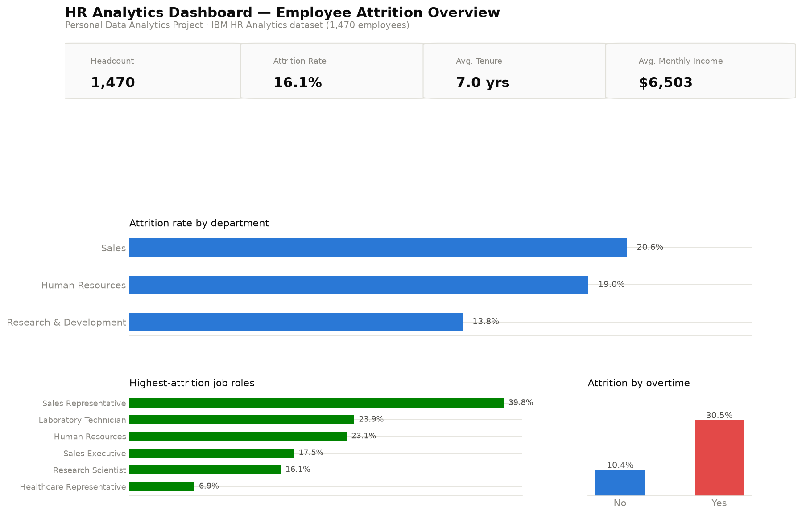

# HR Analytics Dashboard

**Personal Data Analytics Project** — built independently using a public
dataset for portfolio purposes. This is not client work or employer work.

Power BI + SQL + Python analysis of employee attrition, built to answer the
question every HR team eventually asks: *who is leaving, and why?*



## Dataset

[IBM HR Analytics Employee Attrition & Performance](https://github.com/IBM/employee-attrition-aif360)
— a public, fictional dataset of 1,470 employees with department, role,
compensation, tenure, satisfaction, and attrition outcome. Commonly used as a
benchmark HR analytics dataset.

## Business problem

Framed as a realistic HR analytics brief: leadership wants to understand
where attrition is concentrated, whether it's tied to overtime or
compensation, and which employee segment is highest-risk — so retention
effort can be targeted instead of applied evenly across the company.

## Approach

1. **Python** (`python/clean_and_analyze.py`) — loads the raw CSV, drops
   constant columns (`EmployeeCount`, `Over18`, `StandardHours`), removes
   duplicates, buckets tenure into bands, and computes department/role/tenure
   attrition rates. Outputs cleaned CSVs and the dashboard chart images.
2. **SQL** (`sql/queries.sql`) — the same questions expressed as SQL against
   a SQLite database built from the cleaned data, including window functions
   (`RANK`, running totals) and a multi-condition flight-risk segment query.
   Real output for every query is captured in `sql/sample_results.md`.
3. **Power BI** (`powerbi/data-model.md`) — the data model and DAX measures
   documented and ready to build in Power BI Desktop (see note in that file
   on why the `.pbix` itself isn't included).

## Key insights

(All figures computed directly from the dataset — see `sql/sample_results.md`
for full query output.)

- **Overall attrition rate is 16.1%** (237 of 1,470 employees).
- **Overtime is the single strongest signal in the data**: employees who
  work overtime leave at **30.5%**, nearly 3x the rate of those who don't
  (10.4%) — despite average pay being almost identical between the two
  groups ($6,549 vs $6,485/month).
- **Sales has the highest departmental attrition (20.6%)**, driven heavily by
  the Sales Representative role at **39.8%** — more than double the sales
  department average.
- **Attrition is heavily front-loaded**: employees in their first 2 years
  leave at 29.8%, dropping to under 14% by year 3 and staying low through
  tenure — retention risk is concentrated at onboarding, not long-term
  disengagement.
- **A narrow high-risk segment stands out**: employees who work overtime,
  report job satisfaction ≤2, and have ≤3 years tenure — just 56 people —
  leave at **55.4%**, versus 16.1% company-wide.
- Departing employees are paid meaningfully less on average than those who
  stay in every department, most sharply in HR (-$3,630/month).

## Recommendations

1. **Target the 56-person flight-risk segment first** — new joiners on
   overtime with low satisfaction scores are the highest-leverage retention
   intervention, not a company-wide policy change.
2. **Investigate Sales Representative workload and career pathing**
   specifically, rather than treating "Sales" as one uniform problem — the
   role-level gap (39.8% vs 20.6% department average) suggests a role-specific
   cause.
3. **Review onboarding and first-18-month support** given how front-loaded
   attrition is — a small early-tenure retention program would address the
   largest single risk band in the data.
4. **Audit overtime allocation** as a retention lever, not just a workload
   metric — the pay gap between overtime and non-overtime staff is
   negligible, so overtime itself (not compensation) appears to be the driver.

## Tech stack

Python (pandas, matplotlib) · SQL (SQLite, window functions) · Power BI (data
model + DAX, documented) · public dataset, no proprietary or client data.

## Repository structure

```
hr-analytics-dashboard/
├── README.md
├── data/
│   ├── raw/employee_attrition_raw.csv       # original public dataset
│   └── cleaned/                              # cleaned CSVs + SQLite db
├── python/
│   ├── clean_and_analyze.py                  # cleaning, KPIs, chart export
│   └── build_database.py                     # loads cleaned data into SQLite
├── sql/
│   ├── queries.sql                            # 7 business questions in SQL
│   └── sample_results.md                      # real output from each query
├── powerbi/
│   └── data-model.md                          # star schema + DAX measures
└── charts/
    ├── 01_dashboard_overview.png
    └── 02_tenure_income_detail.png
```

## Reproduce locally

```bash
pip install pandas matplotlib
python python/clean_and_analyze.py   # cleans data, writes charts/
python python/build_database.py      # builds data/cleaned/hr_analytics.db
sqlite3 data/cleaned/hr_analytics.db < sql/queries.sql
```
