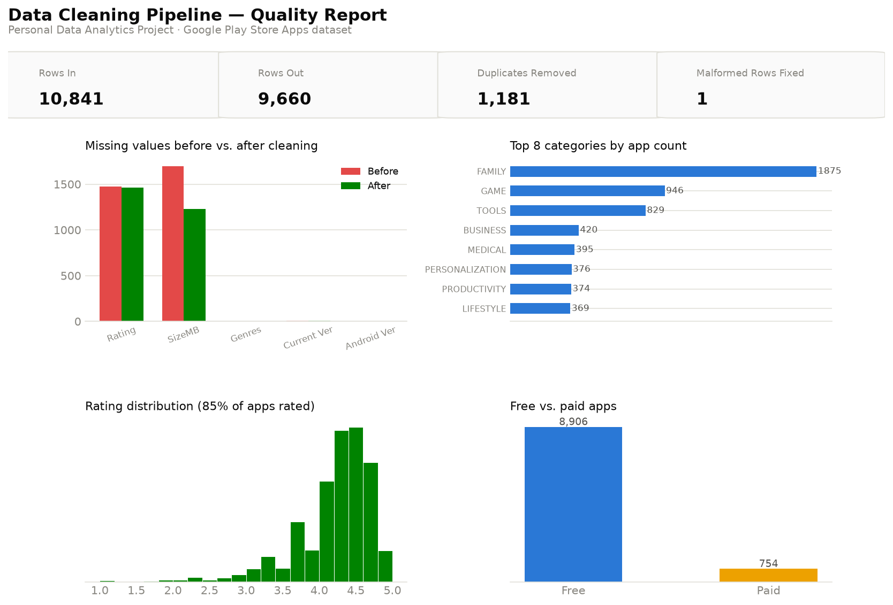

# Python Data Cleaning Automation

**Personal Data Analytics Project** — built independently using a public
dataset for portfolio purposes. This is not client work or employer work.

A reusable Python cleaning pipeline for messy, scraped/exported data — built
against the notoriously messy Google Play Store Apps dataset, with an
auditable before/after data-quality report, plus SQL and Power BI layers on
top of the cleaned output.



## Dataset

The [Google Play Store Apps dataset](https://www.kaggle.com/datasets/lava18/google-play-store-apps)
— 10,841 scraped app listings with genuinely messy real-world formatting:
`Installs` as `"10,000+"`, `Price` as `"$4.99"`, `Size` as `"19M"` or
`"Varies with device"`, and one row with a known column-shift scraping bug.

## Business problem

Framed as a realistic data engineering brief: analysts were reportedly
spending significant time manually cleaning inconsistent exports before any
analysis could start — mismatched formats, duplicate records, and a silent
data-corruption bug that would break any naive numeric parsing. The goal is
a **repeatable, auditable pipeline**, not a one-off cleaning script.

## Approach

The pipeline (`python/cleaning_pipeline.py`) is written as importable,
testable functions rather than a linear script:

- `parse_installs`, `parse_price`, `parse_size_mb` — text-to-numeric parsers
  for each messy format, each independently reusable on other datasets.
- `fix_shifted_rows` — detects and repairs a real scraping bug in this
  dataset: rows missing a `Category` value have every subsequent column
  shifted left by one (confirmed at row 10472 — `Category` reads `"1.9"`,
  a rating value, and `Genres` reads a date). The fix detects rows where
  `Category` is numeric and re-aligns them rather than silently
  misinterpreting `Rating` as `Category`.
- `QualityReport` — a small dataclass that records rows before/after,
  duplicates dropped, malformed rows fixed, and missing-value counts per
  column, so cleaning is **auditable**, not a black box.

`python/build_charts_and_db.py` then builds the dashboard charts and the
SQLite database used by the SQL layer, kept separate so the cleaning logic
stays independently reusable/importable.

## Key insights

(All figures from the actual pipeline run — see `sql/sample_results.md` and
`data/cleaned/data_quality_report.csv`.)

- **1,181 duplicate app listings removed** (10,841 → 9,660 rows) — the same
  app scraped multiple times with different review counts; the pipeline
  keeps the most-reviewed (most complete) version of each.
- **1 confirmed data-corruption row repaired** — without the fix, that row's
  `Rating` field would silently read `19.0` (invalid — ratings cap at 5) and
  its `Category` would be lost entirely; the pipeline both re-aligns the
  columns and validates ratings are within the real 1-5 bound afterward
  (0 out-of-range ratings remain post-clean, confirmed in `sql/sample_results.md`).
- **85% of apps have a rating**, and after cleaning, `SizeMB` is missing for
  ~1,228 apps — every one of those is a genuine `"Varies with device"` entry
  in the source (device-dependent size), not a parsing failure.
- **Family (1,875) and Games (946) dominate the catalog** by app count, but
  Games leads by total installs (13.5B) — the store's most numerous category
  isn't its most-installed one.
- **Paid apps rate slightly higher on average than free apps** (4.26 vs.
  4.17) despite averaging **~110x fewer installs** (76K vs. 8.45M) — paying
  users are a smaller but marginally more satisfied audience in this data.

## Recommendations

1. **Treat "Varies with device" as a first-class category, not missing
   data** in any downstream analysis of app size — nulling it (as this
   pipeline does) is correct for averages, but a real deployment should
   flag it separately rather than drop it silently.
2. **Add the column-shift check as a standing validation rule** for any
   recurring scrape of this kind of data — it's cheap to detect (a numeric
   value where a categorical one is expected) and expensive to miss.
3. **Deduplicate on ingestion, not analysis** — keeping the highest-review
   version of each app is a reasonable default, but a production pipeline
   should log which duplicate was dropped and why, for auditability.

## Tech stack

Python (pandas, dataclasses, regex-based parsing, matplotlib) · SQL
(SQLite, window functions, correlated subqueries) · Power BI (data model +
DAX, documented) · public dataset, no proprietary or client data.

## Repository structure

```
python-data-cleaning-automation/
├── README.md
├── data/
│   ├── raw/googleplaystore_raw.csv            # original public dataset
│   └── cleaned/                                 # cleaned CSV + quality report + SQLite db
├── python/
│   ├── cleaning_pipeline.py                     # reusable cleaning functions + QualityReport
│   └── build_charts_and_db.py                   # dashboard charts + SQLite database
├── sql/
│   ├── queries.sql                               # 6 business questions in SQL
│   └── sample_results.md                         # real output from each query
├── powerbi/
│   └── data-model.md                             # data model + DAX measures
└── charts/
    ├── 01_dashboard_overview.png
    └── 02_installs_size_detail.png
```

## Reproduce locally

```bash
pip install pandas matplotlib
python python/cleaning_pipeline.py     # cleans data, writes data/cleaned/
python python/build_charts_and_db.py   # builds charts/ and playstore_apps.db
sqlite3 data/cleaned/playstore_apps.db < sql/queries.sql
```
