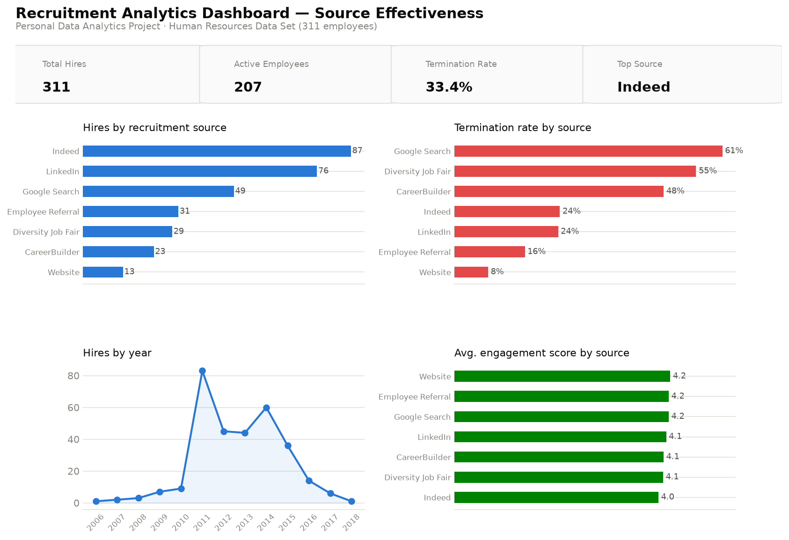

# Recruitment Analytics Dashboard

**Personal Data Analytics Project** — built independently using a public
dataset for portfolio purposes. This is not client work or employer work.

Power BI + SQL + Python analysis of recruitment source effectiveness: which
channels produce hires who stay and perform, and which don't.



## Dataset

The [Human Resources Data Set](https://www.kaggle.com/datasets/rhuebner/human-resources-data-set)
by Dr. Rich Huebner and Dr. Carla Patalano — a **fictional** dataset of 311
employees created for HR analytics teaching case studies, including
recruitment source, engagement survey score, performance rating, and
termination reason. Because it's fictional/synthetic, insights below
demonstrate analytical method, not real workforce findings.

## Business problem

Framed as a realistic recruitment analytics brief: talent acquisition spends
across seven+ sourcing channels with no shared view of which ones actually
produce employees who stay and perform well — sourcing budget is allocated
on gut feel rather than evidence.

## Approach

1. **Python** (`python/clean_and_analyze.py`) — cleans source/department
   labels, parses hire dates, derives `HireYear`, and computes hiring volume,
   termination rate, and engagement score by source. Outputs cleaned CSVs and
   the dashboard chart images.
2. **SQL** (`sql/queries.sql`) — the same questions in SQL, including a
   `RANK()` window function, a correlated subquery to find each department's
   top source, and a year-over-year hiring trend with `LAG()`. Real output
   captured in `sql/sample_results.md`.
3. **Power BI** (`powerbi/data-model.md`) — data model and DAX measures
   documented and ready to build in Power BI Desktop.

## Key insights

(All figures computed directly from the dataset — see `sql/sample_results.md`.
Note "termination rate" here includes **both voluntary and involuntary**
departures as recorded in `TermReason` — it is a churn metric, not a
performance judgment.)

- **Indeed (87 hires) and LinkedIn (76 hires) are the highest-volume
  channels**, together accounting for over half of all hires in the dataset.
- **Volume and retention don't line up.** Google Search is the 3rd-largest
  channel by volume but has the **highest termination rate at 61.2%** — more
  than double the company average (33.4%).
- **Employee Referral is the strongest channel on quality**: a healthy 31
  hires, the **lowest termination rate among high-volume sources (16.1%)**,
  and above-average engagement (4.19).
- **Website applicants have the best retention outcome overall (7.7%
  termination)**, though on a small base (13 hires) — worth monitoring as
  volume grows rather than acting on yet.
- **Diversity Job Fair hires show a higher termination rate (55.2%) than
  standard sourcing (31.2%)** in this dataset. With only 29 hires from this
  channel, that's a signal to investigate onboarding/fit for this cohort, not
  a reason to deprioritize the channel — small samples swing hard.
- **Hiring peaked sharply in 2011 (83 hires, +74 YoY)** then declined most
  years after — a pattern worth understanding operationally (a hiring surge
  followed by a slowdown) before drawing sourcing conclusions from it.

## Recommendations

1. **Shift incremental sourcing budget toward Employee Referral** — it's the
   only high-volume channel combining low termination with above-average
   engagement; a formal referral incentive could scale it further.
2. **Audit the Google Search channel specifically** — its 61.2% termination
   rate against 3rd-highest volume makes it the highest-risk source to keep
   scaling without understanding why.
3. **Investigate the Diversity Job Fair cohort's onboarding experience**
   rather than the channel itself — the small sample (29 hires) means this
   needs a qualitative follow-up, not a budget cut.
4. **Re-baseline "termination rate" by reason** in any real deployment of
   this analysis — this dataset lumps retirements, relocations, and
   dismissals into one field, which understates how each source is actually
   performing on controllable attrition.

## Tech stack

Python (pandas, matplotlib) · SQL (SQLite, window functions, correlated
subqueries) · Power BI (data model + DAX, documented) · public dataset, no
proprietary or client data.

## Repository structure

```
recruitment-analytics-dashboard/
├── README.md
├── data/
│   ├── raw/recruitment_raw.csv                # original public dataset
│   └── cleaned/                                 # cleaned CSVs + SQLite db
├── python/
│   ├── clean_and_analyze.py                     # cleaning, KPIs, chart export
│   └── build_database.py                        # loads cleaned data into SQLite
├── sql/
│   ├── queries.sql                               # 6 business questions in SQL
│   └── sample_results.md                         # real output from each query
├── powerbi/
│   └── data-model.md                             # star schema + DAX measures
└── charts/
    ├── 01_dashboard_overview.png
    └── 02_diversity_department_detail.png
```

## Reproduce locally

```bash
pip install pandas matplotlib
python python/clean_and_analyze.py   # cleans data, writes charts/
python python/build_database.py      # builds data/cleaned/recruitment_analytics.db
sqlite3 data/cleaned/recruitment_analytics.db < sql/queries.sql
```
