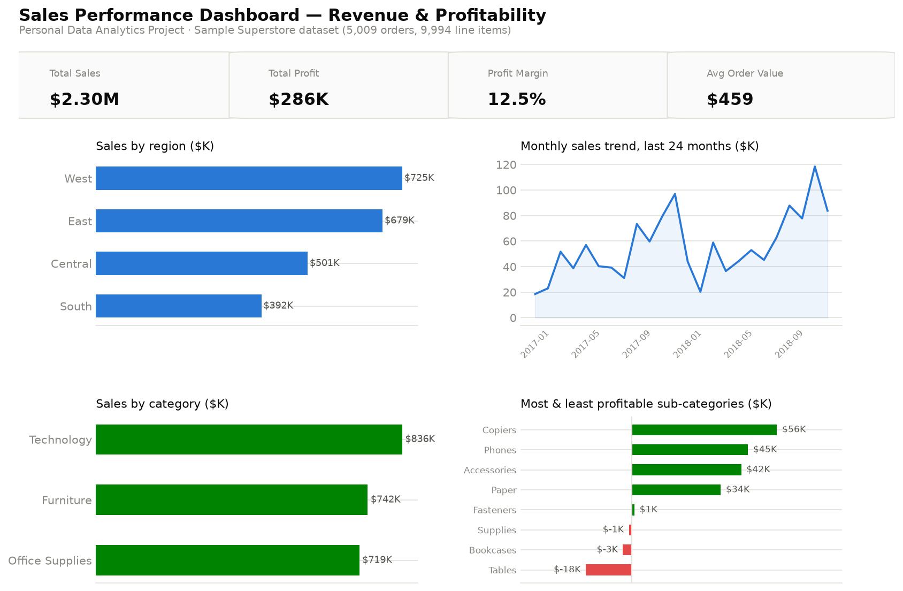

# Sales Performance Dashboard

**Personal Data Analytics Project** — built independently using a public
dataset for portfolio purposes. This is not client work or employer work.

Power BI + SQL + Python analysis of a retail order book: where revenue comes
from, and — more importantly — where discounting quietly destroys margin.



## Dataset

The [Sample Superstore dataset](https://github.com/leonism/sample-superstore)
— a widely-used public retail dataset (5,009 orders / 9,994 line items,
2014-2018) covering US sales across regions, categories, and customer
segments. Originally distributed as Tableau's standard sample dataset.

## Business problem

Framed as a realistic sales analytics brief: the business has healthy total
revenue but wants to understand why overall profit margin is thin, which
regions/categories are actually profitable once discounting is accounted
for, and where sales reps might be over-discounting to close deals.

## Approach

1. **Python** (`python/clean_and_analyze.py`) — parses order/ship dates,
   removes duplicate order lines, derives profit margin and discount bands,
   and aggregates by region, category, sub-category, month, and segment.
2. **SQL** (`sql/queries.sql`) — the same questions in SQL, including a
   `RANK()` window function, a running-total (`SUM() OVER`) monthly trend,
   and a discount-band margin breakdown. Real output in `sql/sample_results.md`.
3. **Power BI** (`powerbi/data-model.md`) — star schema and DAX measures
   documented and ready to build in Power BI Desktop.

## Key insights

(All figures computed directly from the dataset — see `sql/sample_results.md`.)

- **Overall profit margin is 12.5%** on $2.30M in sales ($286K profit) across
  5,009 orders — healthy on paper, but that average hides a sharp split.
- **Discounting above 20% turns orders unprofitable.** Orders with no
  discount average a 34% margin; by the 21-30% discount band, average margin
  is **-11.5%**, and at 50%+ discount it's **-113.9%** — the business loses
  more than the sale price on those orders.
- **Three sub-categories are net loss-makers**: Tables (**-$17,725** on
  $207K sales, 26.1% avg discount), Bookcases (-$3,473), and Supplies
  (-$1,189). Tables alone account for more lost profit than the other two
  combined.
- **Central region has the weakest margin (7.9%)** despite being the
  3rd-largest region by sales — West (14.9%) and East (13.5%) both convert
  revenue to profit meaningfully better.
- **Profit concentration is high**: the top 10 customers by profit contribute
  a disproportionate share relative to their order counts — several with
  fewer than 6 orders each rank in the top 10, suggesting profit depends
  more on order composition (what's bought, at what discount) than on
  customer loyalty/volume alone.
- **Shipping speed doesn't track with order value** — average sale value is
  effectively flat across Same Day ($236), First Class ($228), Second Class
  ($236), and Standard Class ($228), so faster shipping isn't reserved for
  higher-value orders in this data.

## Recommendations

1. **Cap discretionary discounting at ~20%** on Tables and Bookcases
   specifically, or restructure their pricing — past that threshold the
   data shows margin turns negative, not just thinner.
2. **Investigate Central region's cost structure or discount practices**
   separately from its sales volume — the region needs a margin-specific
   review, not just a revenue push.
3. **Build a discount-approval threshold** (e.g., manager sign-off above
   20-30%) since the margin cliff is sharp and consistent enough to set a
   policy around, not just monitor after the fact.
4. **Study the loss-making sub-categories' discount patterns specifically**
   (Tables' 26.1% avg discount vs. company-wide norms) to see whether it's
   sales behavior or list pricing driving the loss.

## Tech stack

Python (pandas, matplotlib) · SQL (SQLite, window functions) · Power BI
(star schema + DAX, documented) · public dataset, no proprietary or client
data.

## Repository structure

```
sales-performance-dashboard/
├── README.md
├── data/
│   ├── raw/superstore_raw.csv                 # original public dataset
│   └── cleaned/                                 # cleaned CSVs + SQLite db
├── python/
│   ├── clean_and_analyze.py                     # cleaning, KPIs, chart export
│   └── build_database.py                        # loads cleaned data into SQLite
├── sql/
│   ├── queries.sql                               # 7 business questions in SQL
│   └── sample_results.md                         # real output from each query
├── powerbi/
│   └── data-model.md                             # star schema + DAX measures
└── charts/
    ├── 01_dashboard_overview.png
    └── 02_discount_segment_detail.png
```

## Reproduce locally

```bash
pip install pandas matplotlib
python python/clean_and_analyze.py   # cleans data, writes charts/
python python/build_database.py      # builds data/cleaned/sales_performance.db
sqlite3 data/cleaned/sales_performance.db < sql/queries.sql
```
