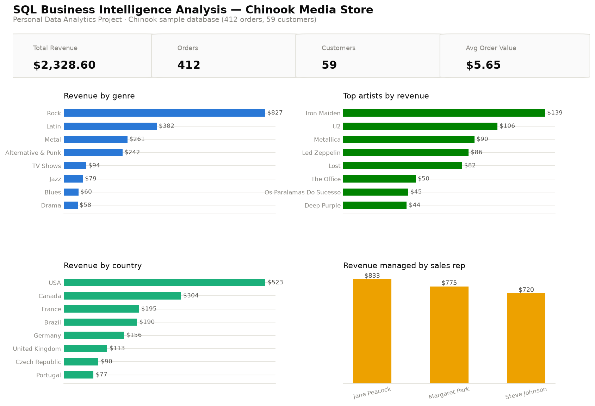

# SQL Business Intelligence Analysis

**Personal Data Analytics Project** — built independently using a public
dataset for portfolio purposes. This is not client work or employer work.

A SQL query library answering realistic business questions against a
relational database — genre and artist performance, customer concentration,
geographic revenue, and sales rep performance — plus a Python/Power BI layer
on top of the same data.



## Dataset

The [Chinook sample database](https://github.com/lerocha/chinook-database)
— a digital media store schema (customers, invoices, tracks, albums,
artists, genres, employees) with 412 orders across 59 customers. Widely used
as a standard practice database for SQL and BI tooling.

## Business problem

Framed as a realistic BI analyst brief: stakeholders keep asking one-off
questions — top genres, best customers, which sales rep manages the most
revenue — that previously required custom spreadsheet work each time. The
goal is a **reusable, documented query library**, not one-off answers.

## Approach

`sql/queries.sql` is the primary artifact: 9 queries covering joins across
up to 4 tables, window functions (`RANK`, running `SUM() OVER`, `LAG` for
month-over-month change), a Pareto-style cumulative-share query, and an
anti-join to find a cross-sell target list. Every query is documented with
what business question it answers, and `sql/sample_results.md` captures
real output from an actual run.

`python/build_charts.py` runs a subset of these queries via `pandas.read_sql`
and renders the dashboard chart images — kept intentionally thin, since SQL
is this project's focus, not Python transformation.

## Key insights

(All figures from actual query output — see `sql/sample_results.md`.)

- **Rock dominates revenue at $826.65 (35.5% of $2,328.60 total)** — more
  than 2x the next genre (Latin, $382.14). Every one of the 59 customers has
  purchased at least one Rock track (query 9 returns zero non-Rock-buying
  customers), so Rock cross-sell is already fully saturated — a smaller
  genre would be a better target for a real cross-sell campaign.
- **Iron Maiden is the top-grossing artist ($138.60)**, ahead of U2 ($105.93)
  and Metallica ($90.09) — consistent with Rock's genre dominance.
- **The USA leads by country (22.5% of revenue)**, but revenue is spread
  fairly evenly across 24 countries with no single non-US market above 13%.
- **The three sales reps manage remarkably even books** — $833, $775, and
  $720 respectively — no single rep is carrying a disproportionate share of
  the customer base or revenue.
- **Customer revenue is unusually evenly distributed for a retail dataset**:
  the top 20 of 59 customers range narrowly from $49.62 down to $39.62, and
  the cumulative-share chart is close to a straight line rather than the
  steep Pareto curve typical of real transactional data (see
  `charts/02_customer_concentration.png`). That's a property of this sample
  dataset, not a real-world pattern — worth knowing before this specific
  chart type is reused on live data.

## An honest data-quality caveat

Query 6 (`sql/sample_results.md`) surfaces something worth flagging rather
than hiding: **monthly invoice counts and totals in Chinook are
near-identical across 5 years** (typically 7 orders and ~$37.62 per month).
That's a known characteristic of this sample database — invoice dates were
generated on a repeating schedule, not sampled from real purchasing
behavior — so this project does **not** claim a monthly revenue trend as a
real insight, and the dashboard charts deliberately exclude a time-series
panel for that reason. Query 6 and its caveat are kept in the query library
specifically because recognizing synthetic/unreliable time data is itself
part of doing this analysis honestly.

## Recommendations

1. **Target a smaller genre for cross-sell**, not Rock — with 100% of
   customers already buying Rock, a genre with lower penetration (e.g. Jazz
   or Blues, both under $80 in revenue) is where a real cross-sell campaign
   would find incremental customers.
2. **Investigate why sales rep books are so even** — in a real business this
   is either a deliberate round-robin assignment policy (worth confirming
   it's still working as intended) or a coincidence worth knowing isn't
   guaranteed to continue.
3. **Don't build a time-series revenue report on this dataset** — regenerate
   or supplement invoice dates with realistic distributions first if the
   goal is to practice trend analysis specifically.

## Tech stack

SQL (SQLite, multi-table joins, window functions, CTEs, anti-joins) ·
Python (pandas for query execution, matplotlib for charts) · Power BI (data
model + DAX, documented) · public sample dataset, no proprietary or client
data.

## Repository structure

```
sql-business-intelligence-analysis/
├── README.md
├── data/
│   ├── raw/chinook.sqlite                      # original public sample database
│   └── cleaned/chinook.sqlite                    # working copy used by queries/scripts
├── python/
│   └── build_charts.py                           # runs queries, renders chart images
├── sql/
│   ├── queries.sql                                # 9 business questions in SQL (the core artifact)
│   └── sample_results.md                          # real output from each query
├── powerbi/
│   └── data-model.md                              # data model + DAX measures
└── charts/
    ├── 01_dashboard_overview.png
    └── 02_customer_concentration.png
```

## Reproduce locally

```bash
pip install pandas matplotlib
sqlite3 data/cleaned/chinook.sqlite < sql/queries.sql   # run the query library directly
python python/build_charts.py                            # regenerate the dashboard charts
```
